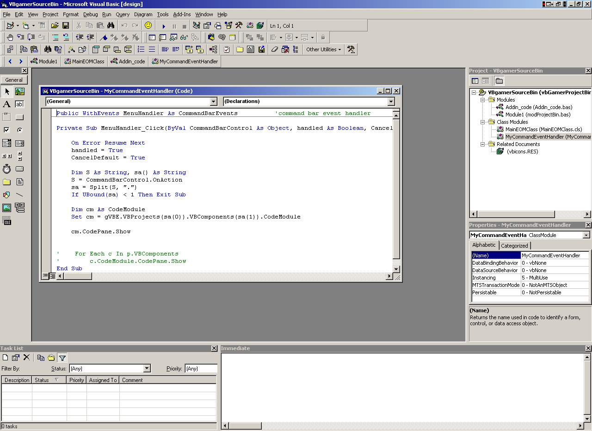

<div align="center">

## Add In for Tabbed Source Viewing


</div>

### Description

This add-in adds a toolbar to the VB IDE and displays, in a tabbed format, each editable file in all loaded projects. This mimics the tabbed code layout in visual studio.net.
 
### More Info
 
Assumptions: Visual Basic uses the Microsoft Office control bar for its interface. A clean install of VB, without Office, will install these shared components. You should have them. Your currently installed version may be different from mine. This control is using the Office 10 object libaray. However, the Office 8 or Office 9 object library works just as well. If you get an error reporting a missing reference then simply click the "Project" menu, then click "Refernces", and then find the appropriate Office libary.

Side Effects: Due to limitations in the extensibility object model the add-in can not function exactly like the vs.net version.

This is also a small piece of a much larger project, so there is probably some leftover code. I tried to strip out everything, but I may have missed something.


<span>             |<span>
---                |---
**Submitted On**   |2006-03-12 11:11:40
**By**             |[Eric Coleman](https://github.com/Planet-Source-Code/PSCIndex/blob/master/ByAuthor/eric-coleman.md)
**Level**          |Advanced
**User Rating**    |4.8 (19 globes from 4 users)
**Compatibility**  |VB 6\.0
**Category**       |[Miscellaneous](https://github.com/Planet-Source-Code/PSCIndex/blob/master/ByCategory/miscellaneous__1-1.md)
**World**          |[Visual Basic](https://github.com/Planet-Source-Code/PSCIndex/blob/master/ByWorld/visual-basic.md)
**Archive File**   |[Add\_In\_for1979733122006\.zip](https://github.com/Planet-Source-Code/eric-coleman-add-in-for-tabbed-source-viewing__1-64632/archive/master.zip)

### API Declarations

```
'More information:
'Read the instructions in Module1 to install.
```


